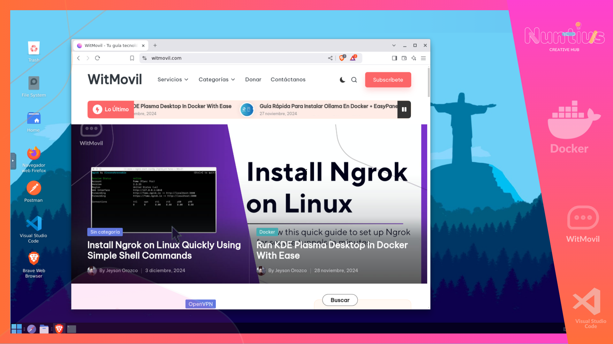

# Brave Browser Installation Script

This script is designed to install the Brave browser on your system. It handles the installation of the necessary dependencies, adds the Brave repository, and creates a desktop shortcut for easy access. Additionally, it configures Brave to work with GPU acceleration if possible and applies browser policies.




<a href="https://ko-fi.com/P5P013UUGZ">
    
</a>

## Prerequisites

Ensure your system is updated and has `wget` installed.

```bash
apt update && apt install -y wget
```

## Installation Instructions

To install Brave browser, follow these steps:

1. **Download and execute the installation script:**

```bash
apt install wget -y
wget https://raw.githubusercontent.com/nuntius-dev/Brave-browser/refs/heads/main/install_brave.sh
chmod +x install_brave.sh
./install_brave.sh
```

### Script Breakdown

- **System Update:** The script first ensures your system is updated.
- **Brave Browser Repository:** Adds the Brave browser repository and its key to ensure a smooth installation.
- **Brave Browser Installation:** Installs Brave browser on your system.
- **Desktop Shortcut:** Creates a desktop shortcut to launch Brave easily.
- **Browser Configuration:**
  - Customizes the Brave executable for GPU acceleration (if supported).
  - Adjusts settings to prevent crashes on startup.
  - Disables Tor within the Brave browser.
  - Configures Chrome-like policies for web filtering.
  
### Features:

- **GPU Acceleration Support:** The script checks for VirtualGL and EGL device support to enable GPU acceleration when starting Brave.
- **Desktop Icon:** A Brave icon is added to your desktop for easy access.
- **Policy Settings:** Applies settings like disabling Tor and enforcing security warnings.
  
## Cleanup

The script includes an optional cleanup process:
- Removes unnecessary package files to free up space.
- Cleans up temporary files to optimize the system.

## Notes

- You may need to run the script with `sudo` privileges depending on your system configuration.
- If you encounter any issues, ensure your system has the necessary dependencies and that there is sufficient disk space.

Aquí tienes un archivo `README.md` que describe cómo usar el script de instalación para Brave Browser en un sistema basado en Debian/Ubuntu:


# Instalar Brave Browser

Este repositorio proporciona un script para instalar el navegador Brave en sistemas basados en Debian/Ubuntu.

## Requisitos previos

Asegúrate de tener `wget` instalado en tu sistema. Si no lo tienes, puedes instalarlo ejecutando el siguiente comando:

```bash
sudo apt update
sudo apt install wget -y
```

## Instrucciones de instalación

1. Descarga el script de instalación de Brave Browser desde el repositorio.

   Ejecuta el siguiente comando:

   ```bash
   wget https://raw.githubusercontent.com/nuntius-dev/Brave-browser/refs/heads/main/install_brave.sh
   ```

2. Otorga permisos de ejecución al script descargado:

   ```bash
   chmod +x install_brave.sh
   ```

3. Ejecuta el script para instalar Brave Browser:

   ```bash
   ./install_brave.sh
   ```

Este script instalará todas las dependencias necesarias, descargará e instalará el navegador Brave, y configurará los accesos directos adecuados en tu sistema.

## Descripción del script

- El script realiza la descarga e instalación del navegador Brave.
- Configura el navegador Brave con una serie de configuraciones personalizadas.
- Añade un acceso directo al escritorio y ajusta las configuraciones de usuario para un arranque optimizado.

## Limpieza

El script también realiza una limpieza después de la instalación para liberar espacio en disco, eliminando archivos temporales y listas de paquetes.

---

Para más información sobre Brave Browser, visita su [sitio web oficial](https://brave.com/).
